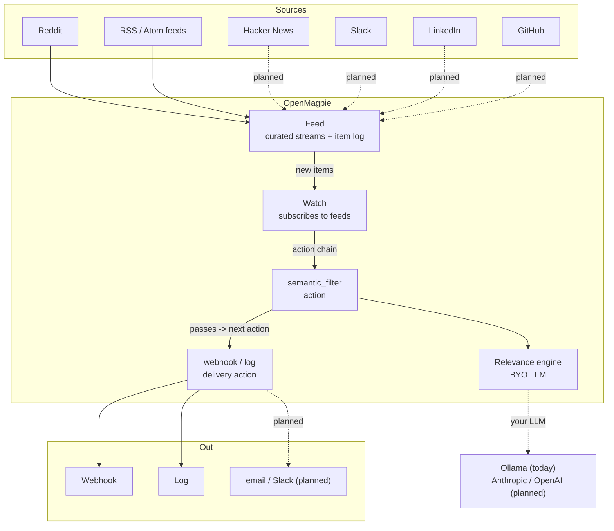

<p align="center">
  
</p>

<p align="center">
  Open-source, self-hostable listening for the conversations that matter to you, so you can join in while they're active.
</p>

<p align="center">
  <a href="LICENSE"></a>
</p>

<p align="center">
  <b><a href="https://www.openmagpie.ai/">openmagpie.ai</a></b> |
  <a href="#quickstart">Quickstart</a> |
  <a href="apps/cli/README.md">CLI reference</a> |
  <a href="CHANGELOG.md">Changelog</a>
</p>

---

> [!TIP]
> **CLI not for you?** A UI / hosted version is on the way. Star the repo for updates, or join the waitlist at [openmagpie.ai](https://www.openmagpie.ai/).

## What it does

You scan Reddit, Hacker News, and a few RSS feeds looking for someone hitting a problem your product solves or asking a question you can answer well. Getting there while the conversation is happening is how you build a brand and a community around what you know. OpenMagpie watches the threads for you so you spend your time on engagement instead of searching.

You curate sources into a feed, write a natural-language description of what's relevant (for example, "someone frustrated with manual social monitoring and asking for alternatives"), and a local LLM scores each new post against it. Matches go to a webhook or your logs (more integrations coming); everything else is dropped. You read the hits instead of the firehose.

## Where it listens

OpenMagpie listens wherever communities are having those conversations.

- **Public discussion (today):** Reddit, Hacker News, and any RSS or Atom feed (news, blogs, Substack publications, and forums that publish feeds).
- **Communities you're in (roadmap):** Slack workspaces and LinkedIn you already belong to, so you catch relevant threads in the groups where you participate, no admin or app install required.

## Quickstart

One command for your first real match (needs Docker and uv; it clones the repo and runs the quickstart for you):

```bash
curl -fsSL https://openmagpie.ai | sh
```

Prefer to not generate seed data? `SKIP_DATA_SEED=1` brings up the stack without sample data:

```bash
curl -fsSL https://openmagpie.ai | SKIP_DATA_SEED=1 sh
```

Prefer to clone first?

```bash
git clone https://github.com/obris-dev/openmagpie.git
cd openmagpie
./scripts/quickstart/run.sh
```

Either way it seeds an example feed + watch (a couple of subreddits, a natural-language filter, a `log` delivery) and, once an Ollama is reachable, runs the pipeline once so the first matches print straight to the logs, tagged with the starter's prefix (e.g. `[oss starter]`). Matches show up in the terminal and the CLI activity log, not the web UI yet. Want a different example or a wider lookback? `STARTER=devtools DAYS=7 ./scripts/quickstart/seed.sh`. See [examples/README.md](examples/README.md) for the full list of starters.

### Prereq: an Ollama instance

OpenMagpie is BYO LLM; the dev stack doesn't bundle one. Point it at an Ollama you control:

- **Local (the default).** `OLLAMA_URL=http://host.docker.internal:11434` already points at your local Ollama. If you don't have one: `brew install ollama` (macOS, or see the [linux install](https://ollama.com/download)), then `ollama pull qwen2.5:7b` and `ollama serve`.
- **Remote (LAN box, GPU server, cloud).** Set `OLLAMA_URL=http://your-host:11434` in `apps/core/.env`.

Set `OLLAMA_DEFAULT_MODEL` to the model you want to judge with. A 7B model judges in roughly 1 to 3 seconds on Apple Silicon or a recent NVIDIA GPU; CPU-only works but is slower.

### Use it

The quickstart already built and seeded everything and put the `magpie` CLI on your `PATH`. Drive it from there:

```bash
magpie auth login                            # browser device flow
magpie feed create                           # opens $EDITOR on a feed template (sources + retention)
magpie watch create                          # opens $EDITOR on a watch template (feeds + action chain)
magpie activity summary --action <action_id> # per-state run breakdown for any action (filter, webhook, log)
```

A watch's `actions:` chain typically starts with a `semantic_filter` (your natural-language criteria + threshold) followed by a `webhook` or `log` delivery. Pick a backfill window when you create the feed and the first `make local-tick` scores real posts against your criteria immediately, with no wait for the scheduler.

Full command list: the [magpie CLI reference](apps/cli/README.md). The dev loop runs through `make`: see [make/README.md](make/README.md) or `make help`.

### Running it continuously

`make local-tick` runs one pass by hand. For ongoing operation, start the background scheduler. The four pipeline stages each tick on their own cadence (poll feeds, trigger watches, drain runs, flush digests):

```bash
make up-jobs                  # start the tickers (a pid + log per stage under .jobs/)
tail -f .jobs/drain.log       # watch a stage
make down-jobs                # stop them
```

Each stage is single-flight: a pass that outruns its interval self-skips the next tick, so loops never stack. Production scheduling is then just a plain cron entry per command on the same cadences, with no flock or singleton infrastructure. Override any cadence inline, e.g. `make up-jobs DRAIN_INTERVAL=30`.

Run `make help` for the full target list (`make up` / `down`, `make logs`, `make local-test`, `make local-check`, and so on).

## How it works

A `Feed` is a reusable, curated stream (a set of sources plus an item log). A `Watch` subscribes to one or more feeds and runs an ordered **action chain** over each new item: a `semantic_filter` gates the chain (a score below threshold stops it), and downstream `webhook` / `log` actions deliver what passes. One feed can back many watches, so you pay for source polling once.



Delivery is **instant** (per item) or **digest** (a window of items batched into one emission). A `webhook` action POSTs (or PUTs / PATCHes) one self-describing body; instant and digest use the same shape (instant is a one-item batch):

```json
{
  "watch": {"id": "01K...", "name": "ai-webhook"},
  "action_id": "01K...",
  "delivery": "digest",
  "window": {"since": "...", "until": "..."},
  "items": [
    {
      "key": "reddit_subreddit:abc123",
      "source": {"label": "r/ClaudeAI", "kind": "reddit_subreddit"},
      "item": {"title": "...", "url": "..."}
    }
  ]
}
```

`item` is the feed item narrowed to the action's `include_fields`. Each item's `key` is `source:external_id`; delivery is at-least-once, so receivers dedup on it. Every call is recorded as a `WatchActionDelivery` you can inspect:

```bash
make local-cli ARGS="delivery list --action <webhook_action_id>"    # the list: state / HTTP / host / items / attempt
make local-cli ARGS="delivery get <delivery_id>"                    # one call in full, incl. the exact body sent
```

See [AGENTS.md](AGENTS.md) for the design conventions (char pointers, typed-blob pattern, the trigger/drain/flush execution model).

## Why self-host it

Social listening is a crowded market (Brand24, Mention, Octolens, Syften, and tools like OutX that pair monitoring with AI-drafted replies). They are all closed SaaS behind a paid plan, a trial, or a sales demo, and the few genuinely free options are basic mention notifiers, not full listening. OpenMagpie is the open, self-hostable exception: run it on your own box with your own model for the cost of the hardware.

- **Open source.** Apache 2.0, the whole stack. Read it, fork it, and extend the connectors and engines yourself.
- **Bring your own LLM.** Relevance is judged by an LLM you run (Ollama today), so your criteria and your matches never leave your infrastructure.
- **Natural-language matching.** You describe what's relevant in natural language and the model scores each new post on meaning.
- **Auditable.** Every poll, judgement, and delivery is a row you can inspect (`magpie activity summary` / `delivery list`), as a table or `--jsonl` to pipe into `jq` / an LLM, or written to a file with `-o`.

## What's shipped today

| Layer | Shipped |
|---|---|
| Connectors | Reddit (`reddit_subreddit`), RSS/Atom (`rss`) |
| Engines | Ollama (`ollama`) |
| Action kinds | `semantic_filter` (LLM-judged), `webhook`, `log` |
| Delivery modes | instant, digest |
| Webhook methods | `POST`, `PUT`, `PATCH` |
| Delivery audit | per-attempt `WatchActionDelivery` |

## Roadmap

- **More connectors**: Hacker News, Slack, LinkedIn, GitHub, Bluesky, Mastodon, and X.
- **More engines**: Anthropic, OpenAI, and a keyword engine behind the same `Engine` Protocol.
- **Learns from feedback**: thumbs up/down on past matches become few-shot examples for the next pass.
- **Run-history in the payload**: the upstream filter score and chain provenance as an opt-in webhook field.
- **Branching and parallel chains**: the data model already carries `WatchPath` and dense action ranks; multi-path and DAG branching are post-v1.
- **Retention**: pruning for `WatchActionRun` and `WatchActionDelivery` history.

## Hosted version

Self-hosting is free and stays free. A managed hosted version (no infrastructure to run) is in the works as the paid tier.

Join the waitlist at [openmagpie.ai](https://www.openmagpie.ai/).

## Project structure

uv workspace; one root `uv.lock` for everything Python.

```
apps/
  core/                       Django backend (deployable)
    common/                   BaseModel (ULID PK + timestamps), ULIDField, locks, db ceilings, /healthz
    accounts/                 User / Account / UserProfile + services + AccountScopedAPIView mixin
    auth_api/                 signup / login / logout / me + tokens/* + device-flow handshake (DRF)
    sources/                  Connectors (Reddit subreddit, RSS/Atom) + SourcePayload classes + registry
    feeds/                    Feed + Source + FeedItem models + poll orchestrator + item log
    engine/                   Engine Protocol + OllamaEngine package + registry
    watches/                  Watch + WatchFeed + WatchPath + WatchAction + WatchActionRun + WatchActionDelivery
    conf/                     settings (base/local), urls, wsgi
  cli/                        magpie CLI (Typer + httpx + Pydantic); distributed as a standalone wheel
packages/
  openmagpie-schema/          Pure Pydantic models shared by core + cli (configs, wire types, feed shapes)
web/                          pnpm workspace: apps/{app,marketing,email-render} (Next.js) + packages/{ui,api-utils,auth,tailwind-config}
make/                         Per-concern Makefile targets
scripts/                      quickstart installer (quickstart/{bootstrap,run,seed}.sh) + dev tooling (Docker preflight, git hooks, whitespace/branch/length checks, make-help)
```

## Documentation

- [CONTRIBUTING.md](CONTRIBUTING.md): contribution flow, branch naming, running the checks.
- [CHANGELOG.md](CHANGELOG.md): notable changes per release.
- [magpie CLI reference](apps/cli/README.md): install + the full command list.
- [make/README.md](make/README.md): the important dev `make` commands (`make help` for the full list).
- [AGENTS.md](AGENTS.md): cross-cutting design conventions, plus per-area notes: [apps/core](apps/core/AGENTS.md), [apps/cli](apps/cli/AGENTS.md), [web](web/AGENTS.md).

## License

OpenMagpie is open source under the [Apache License 2.0](LICENSE), with optional enterprise directories (`**/ee/`) reserved for future commercial features.
